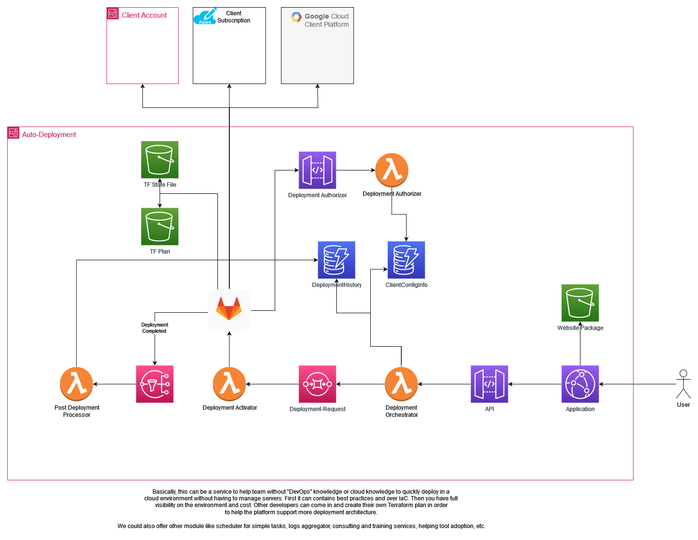

# CloudOps Connect

## Description
This project contains the main logic behind the <APPLICATION-NAME> application. 
This application is used to easily deploy predefined application stack with all the Cloud best practices bundle within
it. It uses the advantage of Terraform for conformity and Infrastructure As Code, and aim for a low cost and easy 
deployment for this tool. 

One of the goal of this service is to allow any developer to deploy the stack on their own Entreprise Cloud and allow 
the different teams to deploy their custom stack. In the same idea, we also aim to offer a SaaS solution in order to 
deploy easily application within the client's Cloud.

---

**⚠️ This is not production-ready software. This project is in active development ⚠️**

---

# Cloud Infrastructure

Inside the `./infrastructure/terraform` folder, you can find the infrastructure created in order to make this application
run in AWS. This architecture can be represented like so:

In order to fully tests the integration with your own setup, you can Fork the
[Deployment-Hub project](https://gitlab.com/dialot-workshop/utilities/deployment-hub/).

# Local Installation

- go inside the ./infrastructure/terraform folder
- ./terraform validate
- ./terraform plan -var-file="prod.tfvars"
- ./terraform apply -var-file="prod.tfvars"

# Testing

tbd

## Support

Help is always appreciated. Every Merge Requests or open issues will be review by the maintainers and updated 
accordingly.

## Roadmap

tbd

## Contributing

Please feel free to submit an issue or pull request. To develop, you'll need to test the script locally with your own 
AWS Credentials. 

## Authors and acknowledgment

- [Nicolas Bazinet](https://gitlab.com/nbazinet)

## License

[GNU GPLv3](./LICENSE)

# Project Status

In Development.